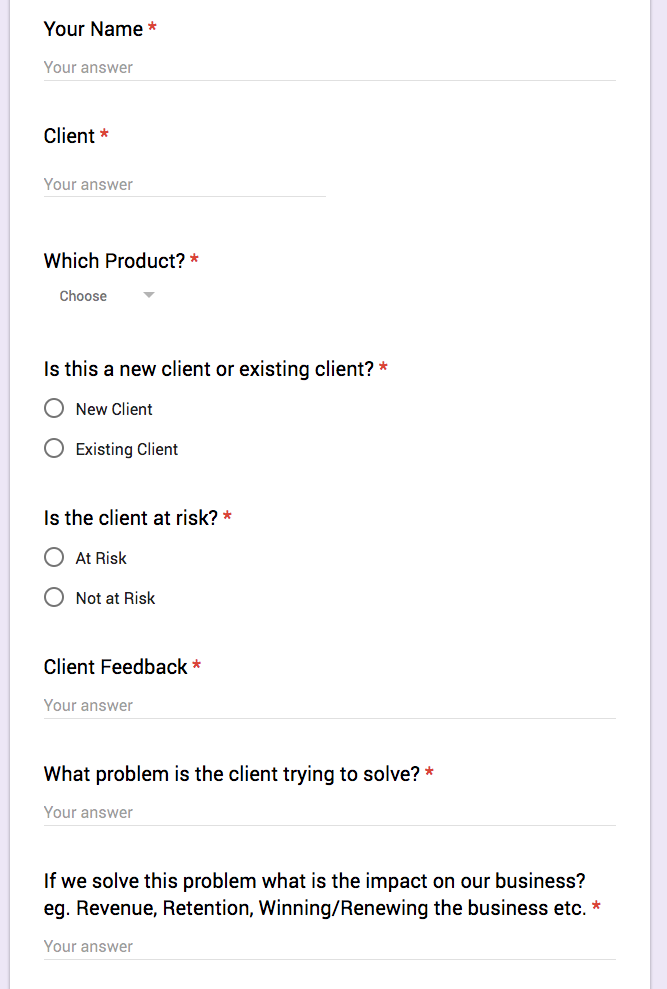

# product-feedback-jira
Capture product feedback via a Google Form and post to Jira, Slack, etc

. You'll need to have a JIRA project created to capture and organize feedback.
We created a Product Feedback (PF) project and then created epic tickets to capture the feedback
submitted from the Google Form. You'll also need to creat a JIRA user that can make tickets to that project.

. Create a Slack Webhook to post reponses: https://api.slack.com/incoming-webhooks. You'll user the use the URL in the code below.

. Create a Google Spreadsheet and copy the ID in the the form code below. The id are the characters after the /d/ in the url.

. Create Google Form and add the GoogleFormCode.gs code in this project to as a script to your project. 
Get there by going to ... > Script Editor... in the google form in the top right corner. Once in the script editor
go to resources > current project triggers and add [onSubmit], [from Form], [On form submit]. You'll need to adjust the script code in a few places to match your systems. You'll also need to make sure to run the submit function manually to get the authorization setup for Google Scripts. The code will error out but it's the authorization that you will need to make sure gets captured.

Here is what our Google Form Looks like:

